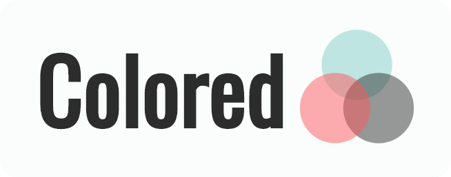

<p align="center">
  
</p>
<h3 align="center">An open-source Flutter app that helps developers and designers work with colors.</h3>

<p align="center">
  <a href="https://drogel.github.io/colored/#/">
    
  </a>
  <a href="https://www.gnu.org/licenses/gpl-3.0.en.html">
    
  </a>
  <a href="https://github.com/drogel/colored/stargazers">
    
  </a>
</p>

## About

The purpose of this project is to develop a useful tool to convert, explore, and manipulate colors for developers and designers, that works on desktop, web and mobile devices. Try it out [on Flutter web!](https://drogel.github.io/colored/#/).

Colored aims to be light-weight, fast and easy to use. It is based on the BLoC pattern, using a Domain-Driven Design. It leverages a massive color dictionary curated by [David Aerne](https://github.com/meodai), which can be found [here](https://github.com/meodai/color-names).

This project has been built using the [Flutter](https://flutter.io/) framework, which allows to build an app for mobile, desktop & web, from a single codebase.

<p align="center">
  
  
  
</p>

## Features

- **Color converter**: convert any color to and from the available formats: Hex, RGB, HSL and HSV.
- **Color naming**: explore the RGB space and get the name of the color you are looking for.
- **Color search**: search in the color dictionary. Look up by name or by hex value.
- **Color families**: get suggestions of color families based on color names.
- **Color palettes**: search in the color palette dictionary, and get suggestions of common color palettes.

## Download & install

First, clone the repository with the 'clone' command.

```
$ git clone https://github.com/drogel/colored.git
```

Then, download either Android Studio or Visual Studio Code, with their respective [Flutter editor plugins](https://flutter.io/get-started/editor/). For more information about Flutter installation procedure, check the [official install guide](https://flutter.io/get-started/install/).

Install dependencies from pubspec.yaml by running `flutter packages get` from the project root (see [using packages documentation](https://flutter.io/using-packages/#adding-a-package-dependency-to-an-app) for details and how to do this in the editor).

There you go, you can now open & edit the project. Enjoy!

## Built with

- [Flutter](https://flutter.dev/) - Beautiful native apps in record time.
- [Android Studio](https://developer.android.com/studio/index.html/) - Tools for building apps on every type of Android device.
- [David Aerne's massive color dictionary](https://github.com/meodai/color-names) - A handpicked list of thousands of unique color names.

## Authors

- **Diego Rogel** - [GitHub](https://github.com/drogel).

## Contributing

If you want to take the time to make this project better, please read the [contributing guides](https://github.com/drogel/colored/blob/master/CONTRIBUTING.md) first. Then, you can open an new [issue](https://github.com/drogel/colored/issues/new/choose), of a [pull request](https://github.com/drogel/colored/compare).

## License

This project is licensed under the GNU GPL v3 License - see the [LICENSE.md](LICENSE.md) file for details.
